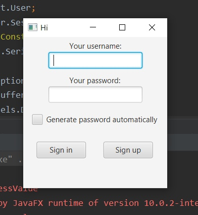
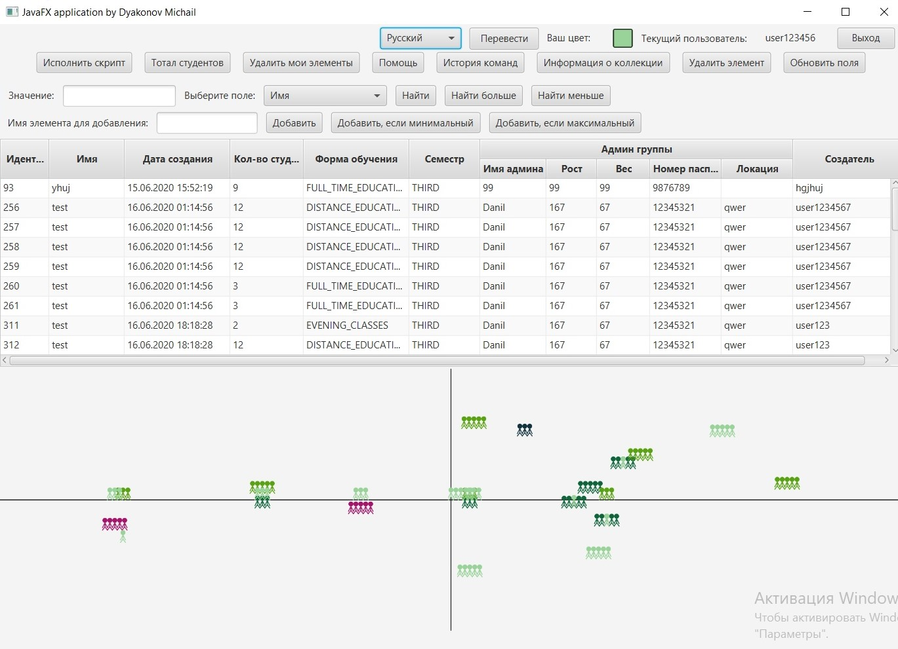

# Lab8
ITMO programming, Lab work 8

#### Task

Доработать программу из лабораторной работы №7 следующим образом:

Заменить консольный клиент на клиент с графическим интерфейсом пользователя(_GUI_).

**В функционал клиента должно входить:**
1. Окно с авторизацией/регистрацией.
2. Отображение текущего пользователя.
3. Таблица, отображающая все объекты из коллекции
   - Каждое поле объекта - отдельная колонка таблицы.
   - Строки таблицы можно фильтровать/сортировать по значениям любой из колонок. Сортировку и фильтрацию значений столбцов реализовать с помощью _Streams API_.
4. Поддержка всех команд из предыдущих лабораторных работ.
5. Область, визуализирующую объекты коллекции
   - Объекты должны быть нарисованы с помощью графических примитивов с использованием _Graphics_, _Canvas_ или аналогичных средств графической библиотеки.
   - При визуализации использовать данные о координатах и размерах объекта.
   - Объекты от разных пользователей должны быть нарисованы разными цветами.
   - При нажатии на объект должна выводиться информация об этом объекте.
   - При добавлении/удалении/изменении объекта, он должен _автоматически_ появиться/исчезнуть/измениться  на области как владельца, так и всех других клиентов. 
   - При отрисовке объекта должна воспроизводиться согласованная с преподавателем _анимация_.
6. Возможность редактирования отдельных полей любого из объектов (принадлежащего пользователю). Переход к редактированию объекта возможен из таблицы с общим списком объектов и из области с визуализацией объекта.
7. Возможность удаления выбранного объекта (даже если команды remove ранее не было).

- Интерфейс должен быть реализован с помощью библиотеки _JavaFX_
- Графический интерфейс клиентской части должен поддерживать _русский_, _исландский_, _польский_ и _испанский (Коста-Рика)_ языки / локали. Должно обеспечиваться корректное отображение чисел, даты и времени в соответстии с локалью. Переключение языков должно происходить без перезапуска приложения. Локализованные ресурсы должны храниться в файле свойств.

**Result**

***Authorization window:***  
  

***Main window:***  

**Acquired skills:**
- JavaFX
- Listener model
- l10n and i18n